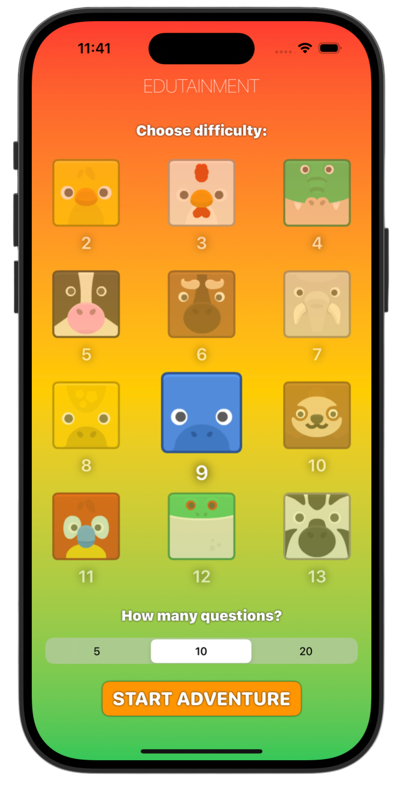
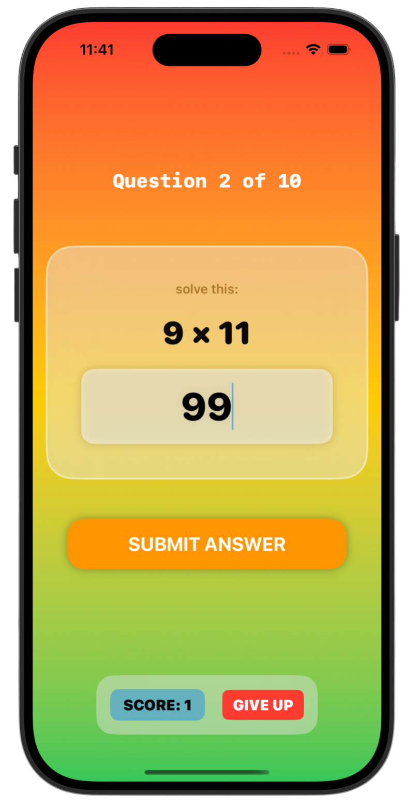

# Edutainment 🦁

*[Milestone Project 2](https://www.hackingwithswift.com/100/swiftui/35)* from the *[100 Days of SwiftUI course](https://www.hackingwithswift.com/100/swiftui)* by *[Hacking With Swift](https://www.hackingwithswift.com/)*

>SwiftUI multiplication training game where users pick difficulty and number of questions, then solve randomized challenges with score tracking and smooth UI transitions.

---

## Functionality 🧩
- 🐾 Fun difficulty selection with animated animal buttons
- 🎲 Randomly generated multiplication questions (based on chosen table)
- 🎭 Game flow with alerts: invalid input, game over, exit game
- 📳 Haptic feedback on correct answers (feels satisfying)
- ✨ Smooth transitions & clean UI styling with gradients + materials

---

## Screenshots

<div align="center">
  
  
  
</div>

---

## Progress 

<div align="center">
  
**Day 35**

*[What you learned](https://www.hackingwithswift.com/guide/ios-swiftui/3/1/what-you-learned)*

*[Key points](https://www.hackingwithswift.com/guide/ios-swiftui/3/2/key-points)*

*[Challenge](https://www.hackingwithswift.com/guide/ios-swiftui/3/3/challenge)*

</div>

---

## Challenge

*Instructions taken from [here](https://www.hackingwithswift.com/guide/ios-swiftui/3/3/challenge)*

> Before we proceed onto more complex projects, it’s important you have lots of time to stop and use what you already have. So, today you have a new project to make entirely by yourself, with no help from me other than some hints below. Are you ready?
>
> Your goal is to build an “edutainment” app for kids to help them practice multiplication tables – “what is 7 x 8?” and so on. Edutainment apps are educational at their core, but ideally have enough playfulness about them to make kids want to play.
>
> **Breaking it down:**
>
> - The player needs to select which multiplication tables they want to practice. This could be pressing buttons, or it could be an “Up to…” `Stepper`, going from 2 to 12.
> - The player should be able to select how many questions they want to be asked: **5**, **10**, or **20**.
> - You should randomly generate as many questions as they asked for, within the difficulty range they asked for.
>
> If you want to go fully down the “education” route then this is going to be some steppers, a text field and a couple of buttons. I would suggest that’s a good place to start, just to make sure you have the basics covered.
>
> Once you have that, it’s down to you how far you want to take the app down the “entertainment” route – you could throw away fixed controls like `Stepper` entirely if you wanted, and instead rely on colorful buttons to get the same result.
>
> This is one of those challenges that is best approached step by step: get something working first, then improve it as far as you want. Maybe you’re happy with a simple app, or maybe you really want to spend some time crafting a fun design. It’s down to you!
>
> **Important:** It’s really easy to get sucked into these challenges and spend hours fighting with a particular bug that only exists because you wanted to get an exact effect. Don’t overload yourself with work, because you’ll just burn out! Instead, start with the simplest possible code that works, then build up slowly.
>
> If you have lots of time on your hands, you could use something like [Kenney’s Animal Pack](https://kenney.nl/assets/animal-pack-redux) to add a fun theme to make it into a real game. Don’t be afraid to add some animations, too – it needs to appeal to kids 9 and under, so bright and colorful is a good idea!
>
> To solve this challenge you’ll need to draw on skills you learned in all the projects so far, but if you start small and work your way forward you stand the best chance of success. At its core this isn’t a complicated app, so get the basics right and expand only if you have the time.
>
> **At the very least, you should:**
>
> 1. Start with an App template, then add some state to determine whether the game is active or whether you’re asking for settings.
> 2. Generate a range of questions based on the user’s settings.
> 3. Show the player how many questions they got correct at the end of the game, then offer to let them play again.
> 4. Once you have your code working, try and see if you can break up your layouts into new SwiftUI views rather than putting everything in `ContentView`.
>
> This requires passing data between views, which isn’t something we’ve covered in detail yet, so in the meantime send data using closures – the button action from your settings view would call a function passed in by the parent view that starts the game with the user’s settings, for example.


---

## Installation

1. Clone this repository:  
   ```bash
   git clone https://github.com/gurman-man/100-days-of-swiftUI.git
   ```
2. Open `MilestoneProjects/02-Edutainment/Edutainment.xcodeproj` in Xcode
3. Run on the simulator or your device

