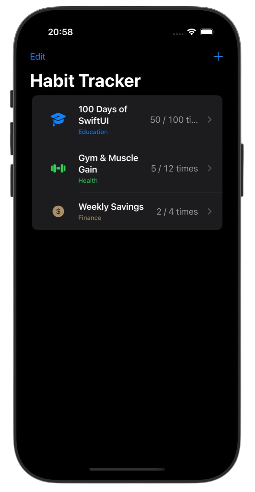
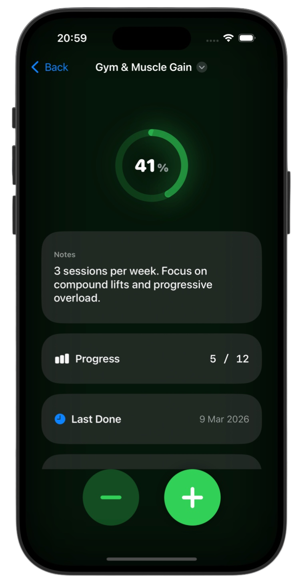
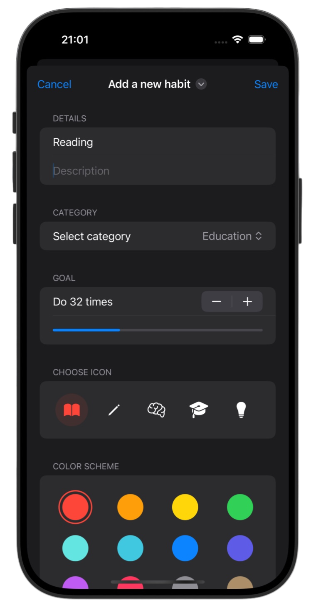
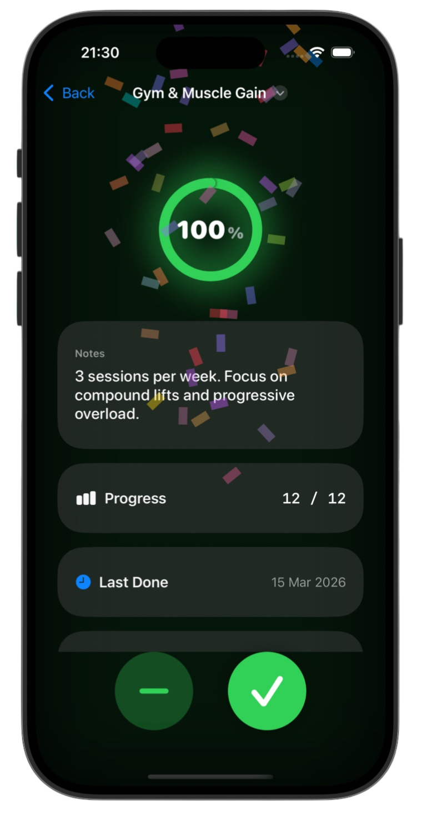

# HabitTracker 📊

*[Milestone Project 3](https://www.hackingwithswift.com/100/swiftui/47)* from the *[100 Days of SwiftUI course](https://www.hackingwithswift.com/100/swiftui)* by *[Hacking With Swift](https://www.hackingwithswift.com/)*

>A SwiftUI habit tracking app that helps users build consistency by creating, tracking, and managing personal habits with progress visualization, streak tracking, and persistent local storage

---

## Functionality 🧩
- 📋 Create and manage habits with categories, icons, colors, and custom goals
- 📊 Visual progress tracking using `Gauge` with animated feedback
- 💾 Persistent storage using `Codable` + `UserDefaults`
- 🔥 Habit streak system with last-completion tracking
- 🎉 Goal completion celebration with a custom confetti animation

---

## Screenshots

<div align="center">
  
  
  
  
</div>

---

## Progress 

<div align="center">
  
**Day 47**

*[What you learned](https://www.hackingwithswift.com/guide/ios-swiftui/4/1/what-you-learned)*

*[Key points](https://www.hackingwithswift.com/guide/ios-swiftui/4/2/key-points)*

*[Challenge](https://www.hackingwithswift.com/guide/ios-swiftui/4/3/challenge)*

</div>

---

## Challenge

*Instructions taken from [here](https://www.hackingwithswift.com/guide/ios-swiftui/4/3/challenge)*

> Before we move on to our next batch of projects, you have a fresh challenge to complete. This means building a complete app from scratch by yourself, using the skills you’ve acquired over the previous three projects.
>
> This time your goal is to build a habit-tracking app, for folks who want to keep track of how much they do certain things. That might be learning a language, practicing an instrument, exercising, or whatever – they get to decide which activities they add, and track it however they want.
>
> At the very least, this means there should be a list of all activities they want to track, plus a form to add new activities – a title and description should be enough.
>
> For a bigger challenge, tapping one of the activities should show a detail screen with the description.
>
> For a tough challenge – see the hints below! – make that detail screen contain how many times they have completed it, plus a button incrementing their completion count.
>
> And if you want to make the app really useful, use `Codable` and `UserDefaults` to load and save all your data.
>
> So, there are three levels to this app, and you can choose how far you want to go depending on how much time you have and how far you want to push yourself.
>
> I do recommend you at least give each level a try, though – every little bit of practice you get helps solidify your learning!


---

## Installation

1. Clone this repository:  
   ```bash
   git clone https://github.com/gurman-man/100-days-of-swiftUI.git
   ```
2. Open `MilestoneProjects/03-HabitTracker/HabitTracker.xcodeproj` in Xcode
3. Run on the simulator or your device

