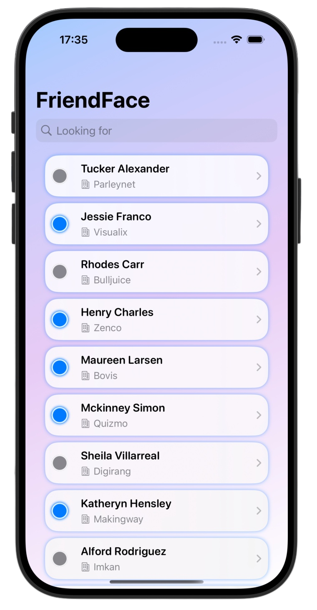
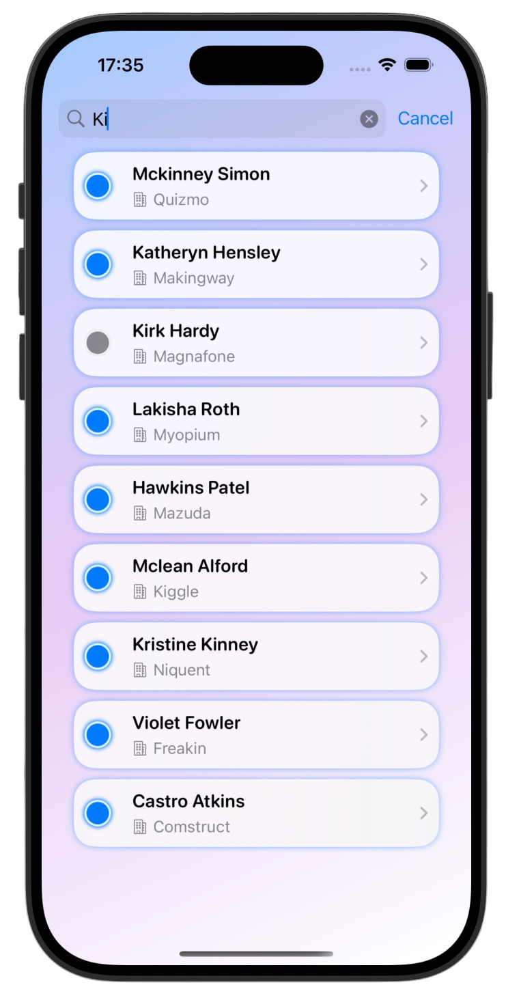
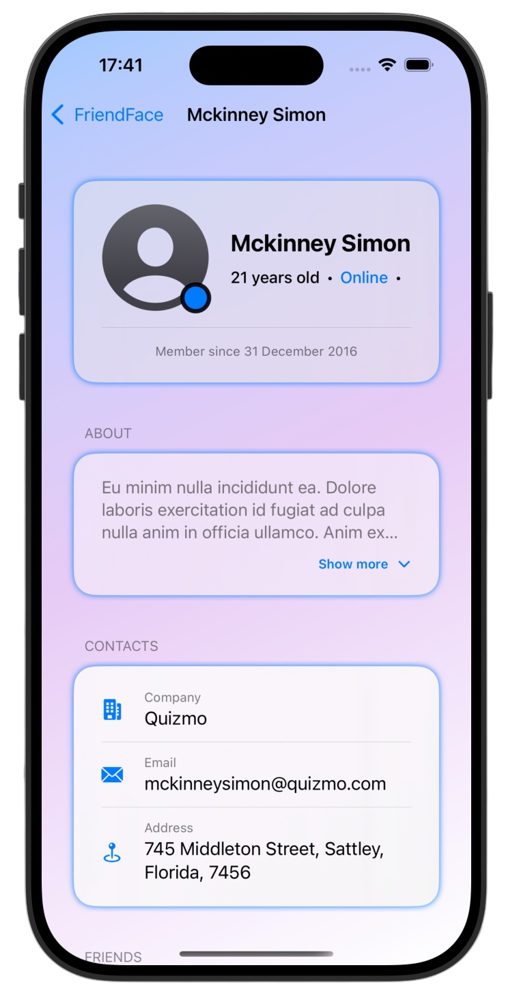
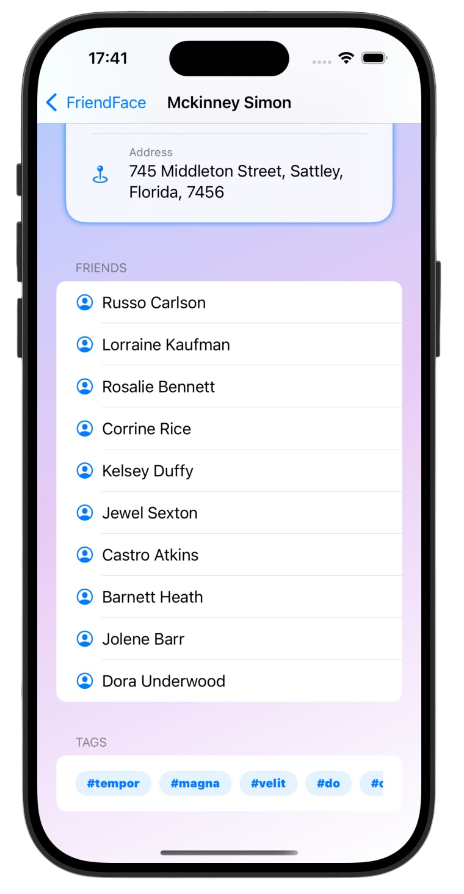

# Friend Face 🎈 

*[Milestone Project 4](https://www.hackingwithswift.com/100/swiftui/60)* from the *[100 Days of SwiftUI course](https://www.hackingwithswift.com/100/swiftui)* by *[Hacking With Swift](https://www.hackingwithswift.com/)*

>A SwiftUI social network app that fetches users from a remote API, stores them locally using SwiftData, and displays detailed profiles with friends, search, and modern UI

---

## Functionality 🧩
- 🌐 Async data fetching with `async/await` and JSON decoding
- 💾 Local persistence using SwiftData with relationships (User ↔ Friends)
- 🔍 Real-time search by name and company using `.searchable`
- 👥 Detailed user profiles with expandable sections, contacts, and friend lists
- 🎨 Custom UI with glassmorphism cards, gradients, and reusable ViewModifiers
- 🔵 User status indicators (online/offline) with dynamic styling
- ⚡ Automatic UI updates via `@Query` and reactive data flow

---

## Screenshots

<div align="center">
  
  
  
  
</div>

---

## Progress 

<div align="center">
  
**Day 60–61**

*[What you learned](https://www.hackingwithswift.com/guide/ios-swiftui/5/1/what-you-learned)*

*[Key points](https://www.hackingwithswift.com/guide/ios-swiftui/5/2/key-points)*

*[Challenge](https://www.hackingwithswift.com/guide/ios-swiftui/5/3/challenge)*

*[Time for SwiftData](https://www.hackingwithswift.com/100/swiftui/61)*

</div>

---

## Challenge

*Instructions taken from [here](https://www.hackingwithswift.com/guide/ios-swiftui/5/3/challenge)*

> It’s time for you to build an app from scratch, and it’s a particularly expansive challenge today: your job is to use `URLSession` to download some JSON from the internet, use `Codable` to convert it to Swift types, then use `NavigationStack`, `List`, and more to display it to the user.
>
> Your first step should be to examine the JSON. The URL you want to use is this: https://www.hackingwithswift.com/samples/friendface.json – that’s a massive collection of randomly generated data for example users.
>
> As you can see, there is an array of people, and each person has an ID, name, age, email address, and more. They also have an array of tag strings, and an array of friends, where each friend has a name and ID.
>
> How far you implement this is down to you, but at the very least you should:
>
>- Fetch the data and parse it into `User` and `Friend` structs.
>- Display a list of users with a little information about them, such as their name and whether they are active right now.
>- Create a detail view shown when a user is tapped, presenting more information about them, including the names of their friends.
>- Before you start your download, check that your `User` array is empty so that you don’t keep starting the download every time the view is shown.
>
> If you’re not sure where to begin, start by designing your types: build a `User` struct with properties for `name`, `age`, `company`, and so on, then a `Friend` struct with `id` and `name`. After that, move onto some `URLSession` code to fetch the data and decode it into your types.
>
> You might notice that the date each user registered has a very specific format: 2015-11-10T01:47:18-00:00. This is known as ISO-8601, and is so common that there’s a built-in `dateDecodingStrategy` called `.iso8601` that decodes it automatically.

---

## Time for SwiftData

*Instructions taken from [here](https://www.hackingwithswift.com/100/swiftui/61)*

> This is a hard challenge. I’m going to give you a small tip below, and some of you might think “tips? Ha! I don’t need tips, I can do this myself!” But please make an exception today, because this small tip will save you hours of headaches.
>
> Here's the tip: You need to make your `User` and `Friend` structs into `@Model` classes that conform to `Codable`. Doing that means adding custom `Codable` conformance: an initializer from a `Decoder`, and an `encode(to:)` method.
>
> If you've forgotten how to do that, reread the [Key Points](https://www.hackingwithswift.com/guide/ios-swiftui/5/2/key-points) summary from the most recent milestone, particularly the section "Completely custom Codable implementations".
>
> For a bigger challenge, tapping one of the activities should show a detail screen with the description.
>
> For a tough challenge – see the hints below! – make that detail screen contain how many times they have completed it, plus a button incrementing their completion count.
>
> That’s it! Again, this is a hard challenge, so please don’t feel bad when it feels hard. Take your time and work through
>
> Good luck!

---

## Installation

1. Clone this repository:  
   ```bash
   git clone https://github.com/gurman-man/100-days-of-swiftUI.git
   ```
2. Open `MilestoneProjects/04-FriendFace/FriendFace.xcodeproj` in Xcode
3. Run on the simulator or your device

