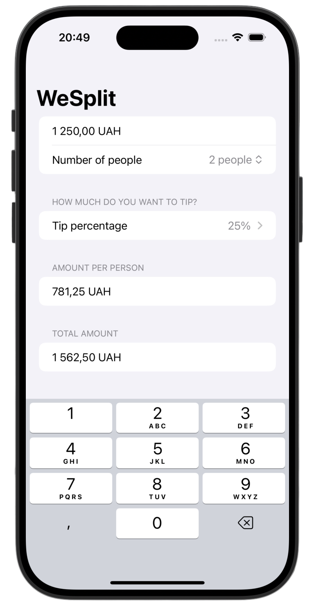
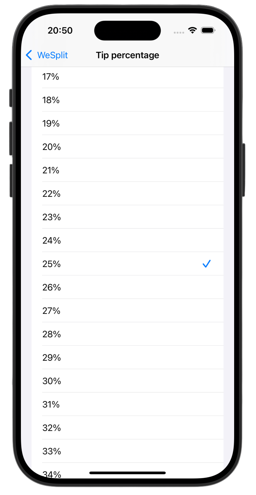
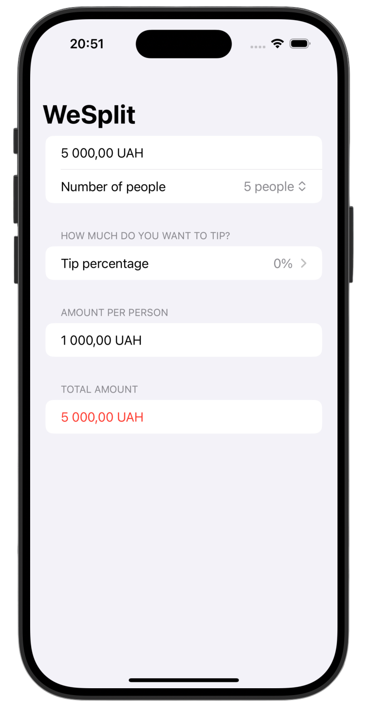

# WeSplit 🧾

[Project 1](https://www.hackingwithswift.com/100/swiftui/16) from the [100 Days of SwiftUI course](https://www.hackingwithswift.com/books/ios-swiftui) by [Hacking With Swift](https://www.hackingwithswift.com/).

>A clean and efficient check-splitting app designed for seamless expense sharing. It automatically handles tip calculations, formats currency based on the user's locale, and provides an instant breakdown of the total cost per person.
>

---

## Functionality 🧩
- 💰 **Currency Formatting** - Automatically detects and applies the local currency symbol (UAH, USD, etc.) based on regional settings.
- 👥 **Split Logic** — Flexible selection of the number of people to split the bill, powered by an intuitive picker. 
- 📈 **Custom Tips** — Allows users to select any tip percentage from 0% to 100% via a dedicated Navigation Link. 
- 🔢 **Grand Total** — Real-time calculation and display of the final amount including tips.
- ⌨️ **Smart Keyboard** — Implements FocusState to easily dismiss the decimal pad using a "Done" button.

---

## Screenshots

<div align="center">
  
  
  
</div>

---

## Lesson Overview / Implementation / Challenges

| Day | Contents |
|:---:|:---|
| [16](https://www.hackingwithswift.com/100/swiftui/16) | <ul><li>[Overview](https://www.hackingwithswift.com/100/swiftui/16)</li></ul> |
| [17](https://www.hackingwithswift.com/100/swiftui/17) | <ul><li>[Implementation](https://www.hackingwithswift.com/100/swiftui/17)</li></ul> |
| [18](https://www.hackingwithswift.com/100/swiftui/18) | <ul><li>[Challenges](https://www.hackingwithswift.com/100/swiftui/18)</li></ul> |

---

## Challenge Instructions

*Instructions taken from [here](https://www.hackingwithswift.com/books/ios-swiftui/wesplit-wrap-up).* 

>1. Add a header to the third section, saying “Amount per person”
>2. Add another section showing the total amount for the check – i.e., the original amount plus tip value, without dividing by the number of people.
>3. Change the tip percentage picker to show a new screen rather than using a segmented control, and give it a wider range of options – everything from 0% to 100%. Tip: use the range `0..<101` for your range rather than a fixed array.
---

## Installation

1. Clone this repository:  
   ```bash
   git clone https://github.com/gurman-man/100-days-of-swiftUI.git
   ```
2. Open `Projects/01-WeSplit/WeSplit.xcodeproj` in Xcode
3. Run on the simulator or your device

