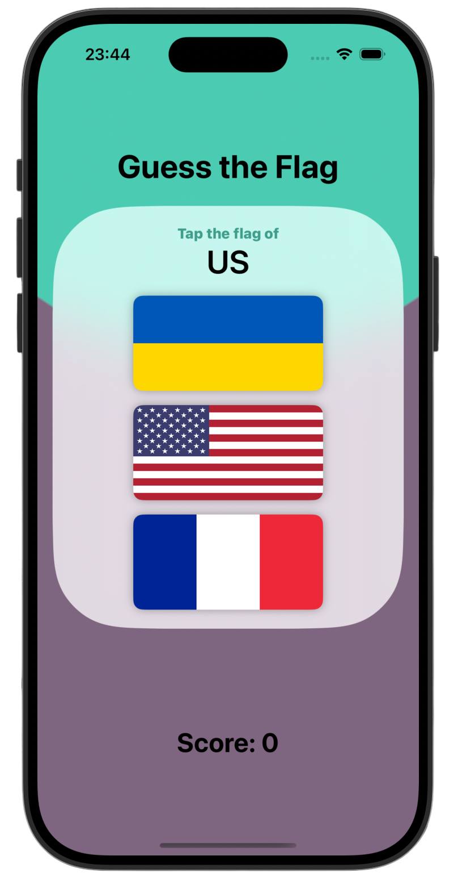
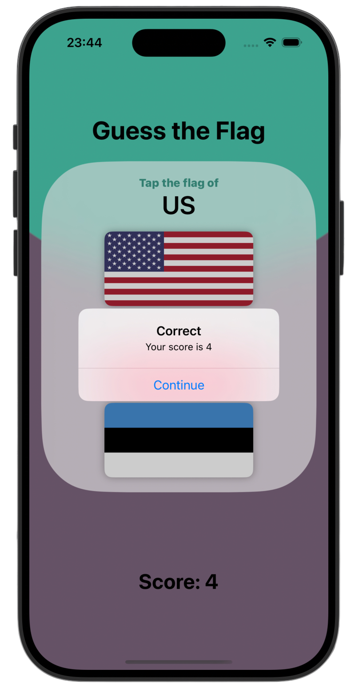
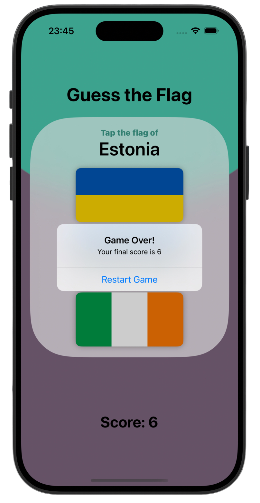

# Guess the Flag ❔

*[Project 2](https://www.hackingwithswift.com/100/swiftui/20)* from the *[100 Days of SwiftUI course](https://www.hackingwithswift.com/books/ios-swiftui)* by *[Hacking With Swift](https://www.hackingwithswift.com/)*

>A simple and engaging quiz game that challenges users to identify country flags.  
Built with SwiftUI, the app demonstrates state management, user interaction, and basic game logic.
>

---

## Functionality 🧩
- 🚩 Randomized flag quiz with multiple choices
- 🎯 Score tracking using `@State`
- ⚠️ Feedback for correct and incorrect answers
- 🧱 Reusable FlagImage component for consistent styling
- 🎨 SwiftUI layout with gradients and material backgrounds

---

## Screenshots

<div align="center">
  
  
  
</div>

---

## Progress 

<div align="center">
  
**Day 20**

*[Overview](https://www.hackingwithswift.com/100/swiftui/20)*

**Day 21**

*[Implementation](https://www.hackingwithswift.com/100/swiftui/21)*

**Day 22**

*[Challenges](https://www.hackingwithswift.com/100/swiftui/22)*

</div>

---

## Challenges

*Instructions taken from [here](https://www.hackingwithswift.com/books/ios-swiftui/guess-the-flag-wrap-up)*

| <div align="center">Challenge</div> | <div align="center">Status</div> |
|:---|:---:|
| 1. Add an `@State` property to store the user’s score, modify it when they get an answer right or wrong, then display it in the alert and in the score label. | ✅ |
| 2. When someone chooses the wrong flag, tell them their mistake in your alert message – something like “Wrong! That’s the flag of France,” for example. | ✅ |
| 3. Make the game show only 8 questions, at which point they see a final alert judging their score and can restart the game. | ✅ |

---

## Installation

1. Clone this repository:  
   ```bash
   git clone https://github.com/gurman-man/100-days-of-swiftUI.git
   ```
2. Open `Projects/02-GuessTheFlag/GuessTheFlag.xcodeproj` in Xcode
3. Run on the simulator or your device

