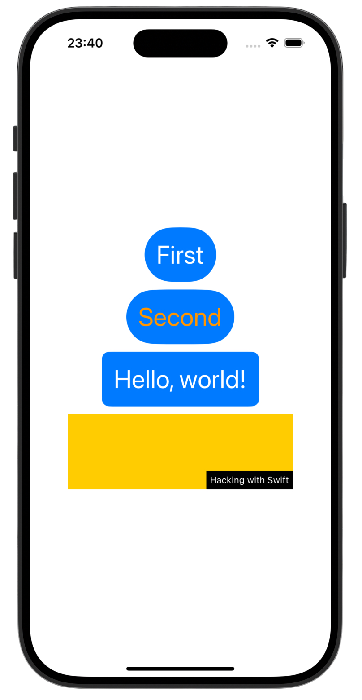
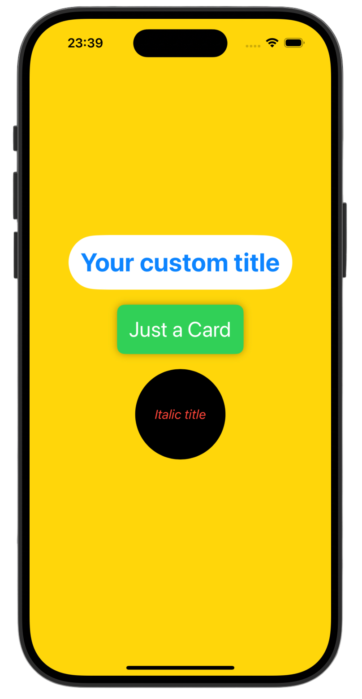

# Views and Modifiers 🍋‍🟩

*[Project 3](https://www.hackingwithswift.com/100/swiftui/23)* from the *[100 Days of SwiftUI course](https://www.hackingwithswift.com/books/ios-swiftui)* by *[Hacking With Swift](https://www.hackingwithswift.com/)*

>A SwiftUI fundamentals project focused on reusable UI components and custom styling architecture.  
>Demonstrates clean view composition using custom `ViewModifiers` and `View` extensions.

---

## Functionality 🧩
- 🎨 Custom ViewModifiers
- 🧱 Reusable UI components
- ❄️ View extensions for clean API
- 🧠 Declarative view composition
- 🔁 Styling reuse & consistency

---

## Screenshots

<div align="center">
  
  
</div>

---

## Progress 

<div align="center">

*[Overview](https://www.hackingwithswift.com/books/ios-swiftui/views-and-modifiers-introduction)*

**Day 23**

*[Implementation](https://www.hackingwithswift.com/100/swiftui/23)*

**Day 24**

*[Challenges](https://www.hackingwithswift.com/100/swiftui/24)*

</div>

---

## Challenges

*Instructions taken from [here](https://www.hackingwithswift.com/books/ios-swiftui/views-and-modifiers-wrap-up)*

| <div align="center">Challenge</div> | <div align="center">Status</div> |
|:---|:---:|
| 1. Go back to project 1 and use a conditional modifier to change the total amount text view to red if the user selects a 0% tip. | ✅ |
| 2. Go back to project 2 and replace the `Image` view used for flags with a new `FlagImage()` view that renders one flag image using the specific set of modifiers we had. | ✅ |
| 3. Create a custom `ViewModifier` (and accompanying `View` extension) that makes a view have a large, blue font suitable for prominent titles in a view. | ✅ |

---

## Installation

1. Clone this repository:  
   ```bash
   git clone https://github.com/gurman-man/100-days-of-swiftUI.git
   ```
2. Open `Projects/03-ViewsAndModifiers/ViewsAndModifiers.xcodeproj` in Xcode
3. Run on the simulator or your device

