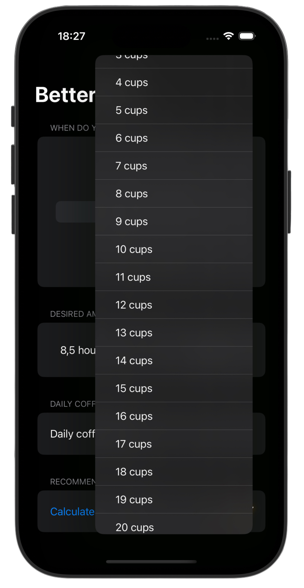
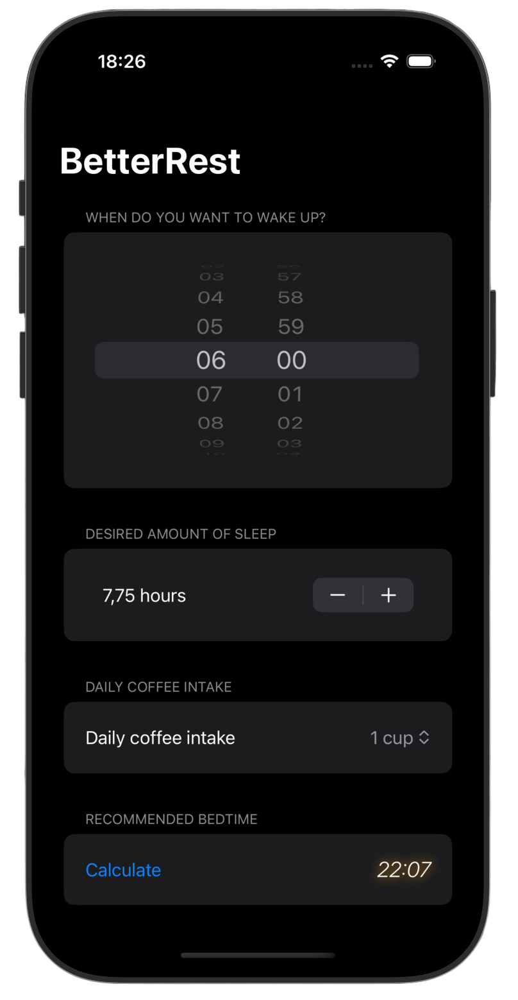

# Better Rest ⏰

*[Project 4](https://www.hackingwithswift.com/100/swiftui/26)* from the *[100 Days of SwiftUI course](https://www.hackingwithswift.com/books/ios-swiftui)* by *[Hacking With Swift](https://www.hackingwithswift.com/)*

>A smart sleep assistant app that calculates the ideal bedtime based on wake-up time, desired sleep duration, and daily coffee intake.

The app uses a CoreML machine learning model to generate personalized sleep recommendations through a clean and intuitive SwiftUI interface.
>

---

## Functionality 🧩
- 🧠 CoreML-powered sleep prediction
- ⏰ Wake-up time input via `DatePicker`
- 😴 Adjustable sleep duration (4–12h)
- ☕ Coffee intake tracking with `Picker`
- 🧾 Clean `Form` + `Section` based UI layout

---

## Screenshots

<div align="center">
  
  
</div>

---

## Progress 

<div align="center">
  
**Day 26**

*[Overview](https://www.hackingwithswift.com/100/swiftui/26)*

**Day 27**

*[Implementation](https://www.hackingwithswift.com/100/swiftui/27)*

**Day 28**

*[Challenges](https://www.hackingwithswift.com/100/swiftui/28)*

</div>

---

## Challenges

*Instructions taken from [here](https://www.hackingwithswift.com/books/ios-swiftui/betterrest-wrap-up)*

| <div align="center">Challenge</div> | <div align="center">Status</div> |
|:---|:---:|
| 1. Add a header to the third section, saying “Amount per person”. | ✅ |
| 2. Add another section showing the total amount for the check – i.e., the original amount plus tip value, without dividing by the number of people. | ✅ |
| 3. Change the tip percentage picker to show a new screen rather than using a segmented control, and give it a wider range of options – everything from 0% to 100%. Tip: use the range `0..<101` for your range rather than a fixed array. | ✅ |

---

## Installation

1. Clone this repository:  
   ```bash
   git clone https://github.com/gurman-man/100-days-of-swiftUI.git
   ```
2. Open `Projects/04-BetterRest/BetterRest.xcodeproj` in Xcode
3. Run on the simulator or your device

