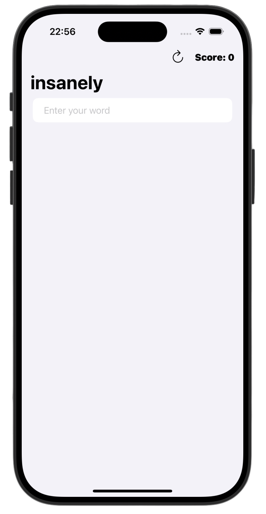
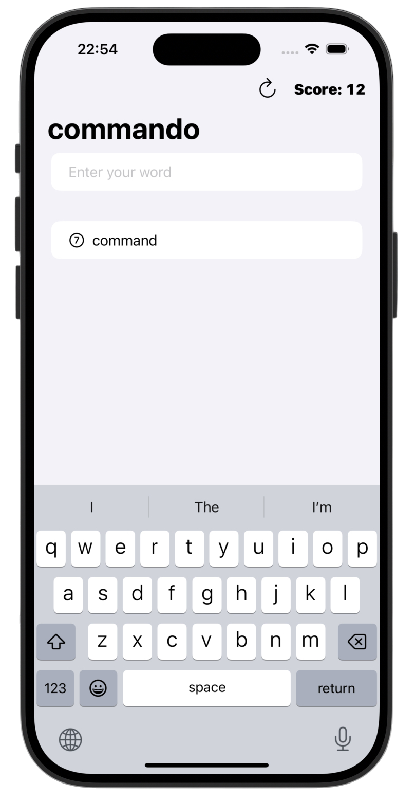

# Word Scramble 💬

*[Project 5](https://www.hackingwithswift.com/100/swiftui/29)* from the *[100 Days of SwiftUI course](https://www.hackingwithswift.com/books/ios-swiftui)* by *[Hacking With Swift](https://www.hackingwithswift.com/)*

>A word puzzle game where players create new words from a given root word.  
Built with SwiftUI, the app focuses on text input handling, validation logic, and score tracking.
>

---

## Functionality 🧩
- 🔤 Word creation based on a random root word
- ✅ Multiple validation rules (original, possible, real, length)
- 📚 Dictionary validation using `UITextChecker`
- 🏆 Score system based on word length
- 🧱 Clean SwiftUI layout using `List`, `Section`, and `Toolbar`

---

## Screenshots

<div align="center">
  
  
  
</div>

---

## Progress 

<div align="center">
  
**Day 29**

*[Overview](https://www.hackingwithswift.com/100/swiftui/29)*

**Day 30**

*[Implementation](https://www.hackingwithswift.com/100/swiftui/30)*

**Day 31**

*[Challenges](https://www.hackingwithswift.com/100/swiftui/31)*

</div>

---

## Challenges

*Instructions taken from [here](https://www.hackingwithswift.com/books/ios-swiftui/word-scramble-wrap-up)*

| <div align="center">Challenge</div> | <div align="center">Status</div> |
|:---|:---:|
| 1. Disallow answers that are shorter than three letters or are just our start word. | ✅ |
| 2. Add a toolbar button that calls `startGame()`, so users can restart with a new word whenever they want to. | ✅ |
| 3. Put a text view somewhere so you can track and show the player’s score for a given root word. How you calculate score is down to you, but something involving number of words and their letter count would be reasonable. | ✅ |

---

## Installation

1. Clone this repository:  
   ```bash
   git clone https://github.com/gurman-man/100-days-of-swiftUI.git
   ```
2. Open `Projects/05-WordScramble/WordScramble.xcodeproj` in Xcode
3. Run on the simulator or your device

