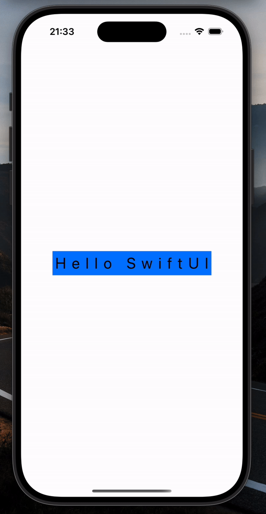
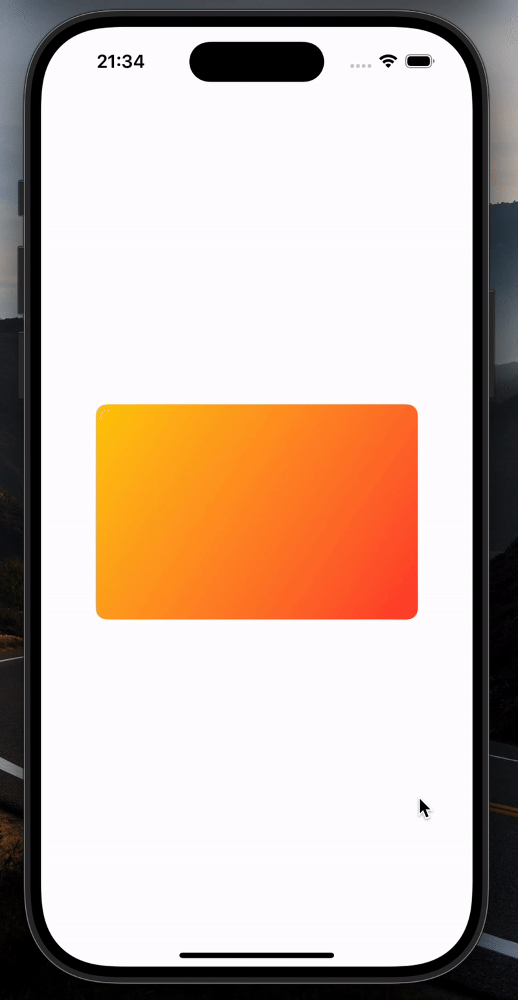
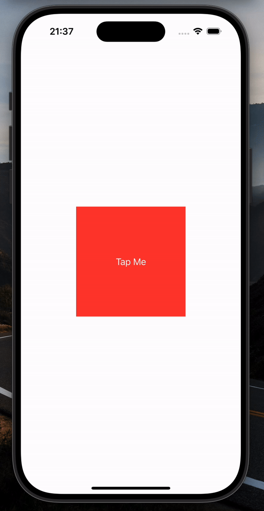

# Animations 🪼

*[Project 6](https://www.hackingwithswift.com/100/swiftui/32)* from the *[100 Days of SwiftUI course](https://www.hackingwithswift.com/books/ios-swiftui)* by *[Hacking With Swift](https://www.hackingwithswift.com/)*

>SwiftUI animation experiments: gestures, delayed effects, transitions and custom ViewModifier-based animations.

---

## Functionality 🧩
- 🎛️ Implicit vs explicit animations (`.animation` vs `withAnimation`)
- 🖐️ Drag gesture animations with smooth snap-back effect
- 🔤 Staggered text animation (each letter moves with its own delay)
- ✨ Smooth view transitions: `.scale`, `.opacity`, `.asymmetric`
- 🌀 Custom `.pivot` transition built with `ViewModifier` (rotation + clipping magic)

---

## Screenshots

<div align="center">
  
  
  
  
</div>

---

## Progress 

<div align="center">
  
**Day 32**

*[Overview](https://www.hackingwithswift.com/100/swiftui/32)*

**Day 33**

*[Implementation](https://www.hackingwithswift.com/100/swiftui/30)*

**Day 34**

*[Challenges](https://www.hackingwithswift.com/100/swiftui/31)*

</div>

---

## Challenges

*Instructions taken from [here](https://www.hackingwithswift.com/books/ios-swiftui/animation-wrap-up)*

| <div align="center">Challenge</div> | <div align="center">Status</div> |
|:---|:---:|
| 1. When you tap a flag, make it spin around 360 degrees on the Y axis. | ✅ |
| 2. Make the other two buttons fade out to 25% opacity. | ✅ |
| 3. Add a third effect of your choosing to the two flags the user didn’t choose – maybe make them scale down? Or flip in a different direction? Experiment! | ✅ |

---

## Installation

1. Clone this repository:  
   ```bash
   git clone https://github.com/gurman-man/100-days-of-swiftUI.git
   ```
2. Open `Projects/06-Animations/Animations.xcodeproj` in Xcode
3. Run on the simulator or your device

