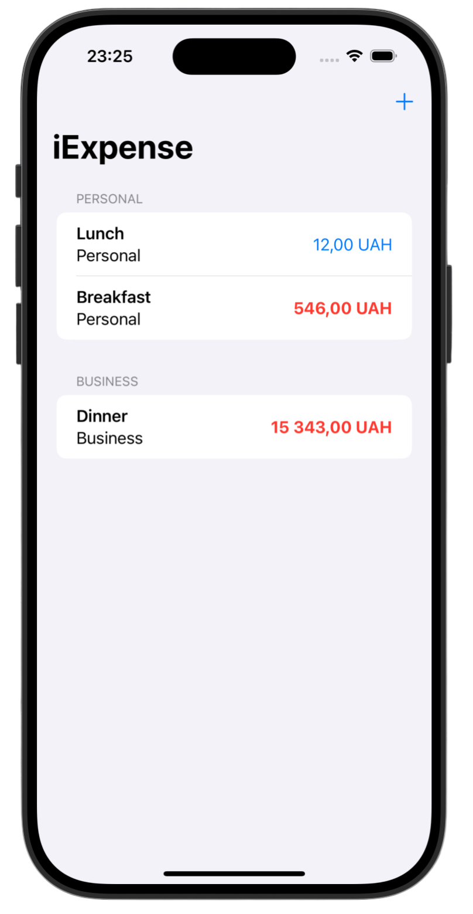
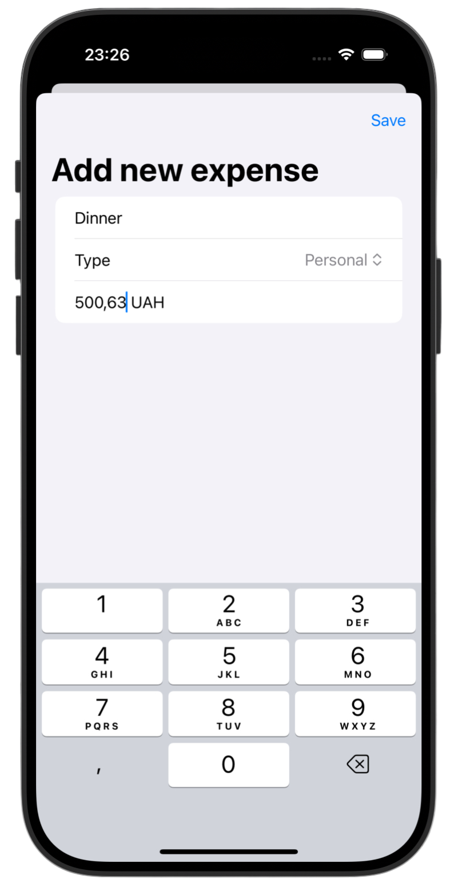

# iExpense 💰

*[Project 7](https://www.hackingwithswift.com/100/swiftui/32)* from the *[100 Days of SwiftUI course](https://www.hackingwithswift.com/books/ios-swiftui)* by *[Hacking With Swift](https://www.hackingwithswift.com/)*

>SwiftUI expense tracker app that lets users add, categorize, and manage expenses with persistent storage using `UserDefaults` + `Codable`.

---

## Functionality 🧩
- 🧾 Add new expenses through a clean `Form` interface
- 💼 Category system: **Personal** vs **Business**
- 💾 Persistent storage using `Codable` + `UserDefaults`
- 🪙 Currency formatting based on user locale (`Locale.current`)
- 🗑️ Swipe-to-delete with correct section-safe removal logic

---

## Screenshots

<div align="center">
  
  
</div>

---

## Progress 

<div align="center">
  
**Day 36**

*[Overview](https://www.hackingwithswift.com/100/swiftui/36)*

**Day 37**

*[Implementation](https://www.hackingwithswift.com/100/swiftui/37)*

**Day 38**

*[Challenges](https://www.hackingwithswift.com/100/swiftui/38)*

</div>

---

## Challenges

*Instructions taken from [here](https://www.hackingwithswift.com/books/ios-swiftui/iexpense-wrap-up)*

| <div align="center">Challenge</div> | <div align="center">Status</div> |
|:---|:---:|
| 1. Use the user’s preferred currency, rather than always using US dollars. | ✅ |
| 2. Modify the expense amounts in `ContentView` to contain some styling depending on their value – expenses under $10 should have one style, expenses under $100 another, and expenses over $100 a third style. What those styles are depend on you. | ✅ |
| 3. For a bigger challenge, try splitting the expenses list into two sections: one for personal expenses, and one for business expenses. This is tricky for a few reasons, not least because it means being careful about how items are deleted! | ✅ |

---

## Installation

1. Clone this repository:  
   ```bash
   git clone https://github.com/gurman-man/100-days-of-swiftUI.git
   ```
2. Open `Projects/07-iExpense/iExpense.xcodeproj` in Xcode
3. Run on the simulator or your device

