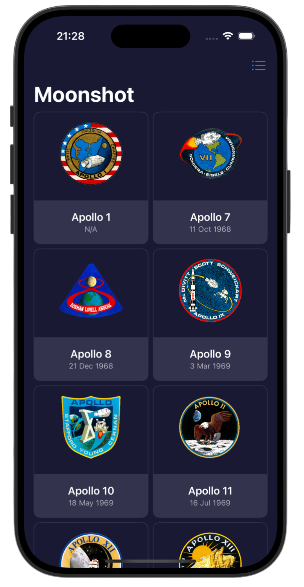
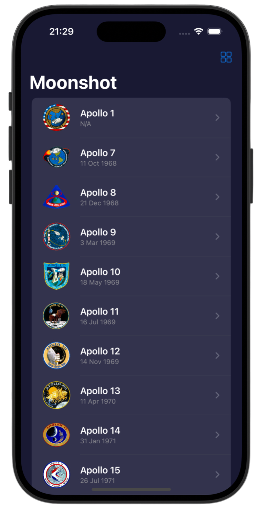
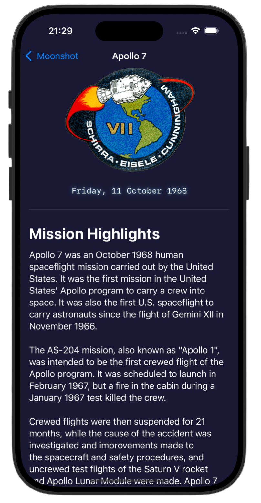
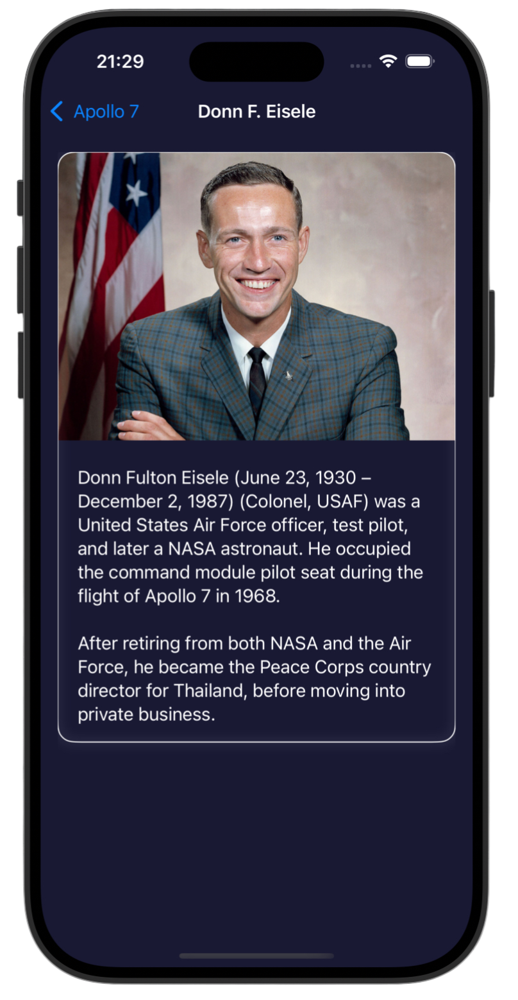

# Moonshot 🪙

*[Project 8](https://www.hackingwithswift.com/100/swiftui/39)* from the *[100 Days of SwiftUI course](https://www.hackingwithswift.com/books/ios-swiftui)* by *[Hacking With Swift](https://www.hackingwithswift.com/)*

>SwiftUI space missions explorer app that loads NASA Apollo mission data from local JSON, featuring dynamic navigation, grid/list layouts, and detailed astronaut profiles.

---

## Functionality 🧩
- 🌌 Apollo missions loaded and decoded from local JSON using `Codable`
- 🔄 Grid ⇄ List toggle with animated toolbar switch
- 🧑‍🚀 Horizontal crew scroll with navigation to astronaut profiles
- 📅 Launch date formatting with custom styling
- 🌙 Fully custom dark theme with reusable background colors

---

## Screenshots

<div align="center">
  
  
  
  
</div>

---

## Progress 

<div align="center">
  
**Day 39**

*[Overview](https://www.hackingwithswift.com/100/swiftui/39)*

**Day 40**

*[Implementation](https://www.hackingwithswift.com/100/swiftui/40)*

**Day 41**

*[Implementation: 2](https://www.hackingwithswift.com/100/swiftui/41)*

**Day 42**

*[Challenges](https://www.hackingwithswift.com/100/swiftui/42)*

</div>

---

## Challenges

*Instructions taken from [here](https://www.hackingwithswift.com/books/ios-swiftui/moonshot-wrap-up)*

| <div align="center">Challenge</div> | <div align="center">Status</div> |
|:---|:---:|
| 1. Add the launch date to `MissionView`, below the mission badge. You might choose to format this differently given that more space is available, but it’s down to you. | ✅ |
| 2. Extract one or two pieces of view code into their own new SwiftUI views – the horizontal scroll view in `MissionView` is a great candidate, but if you followed my styling then you could also move the `Rectangle` dividers out too. | ✅ |
| 3. For a tough challenge, add a toolbar item to `ContentView` that toggles between showing missions as a grid and as a list. | ✅ |

---

## Installation

1. Clone this repository:  
   ```bash
   git clone https://github.com/gurman-man/100-days-of-swiftUI.git
   ```
2. Open `Projects/08-Moonshot/Moonshot.xcodeproj` in Xcode
3. Run on the simulator or your device

