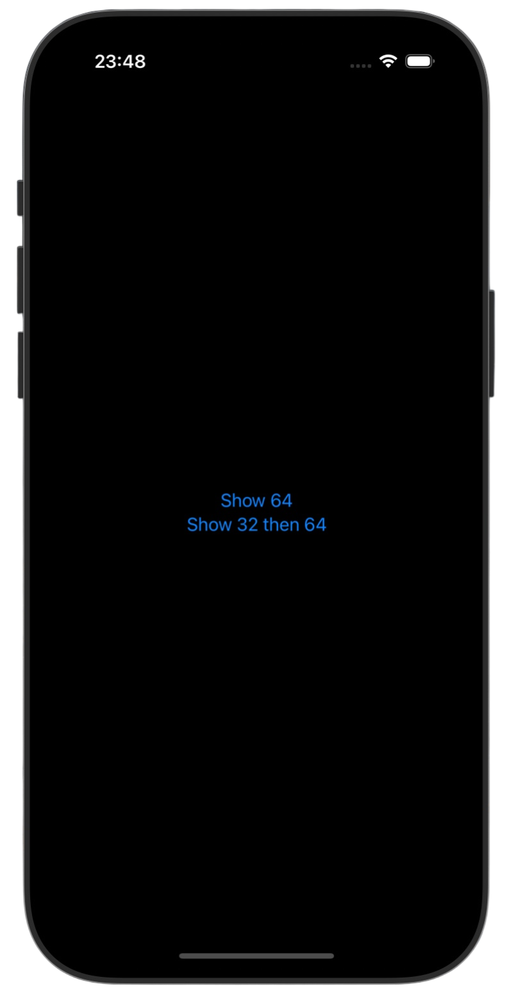
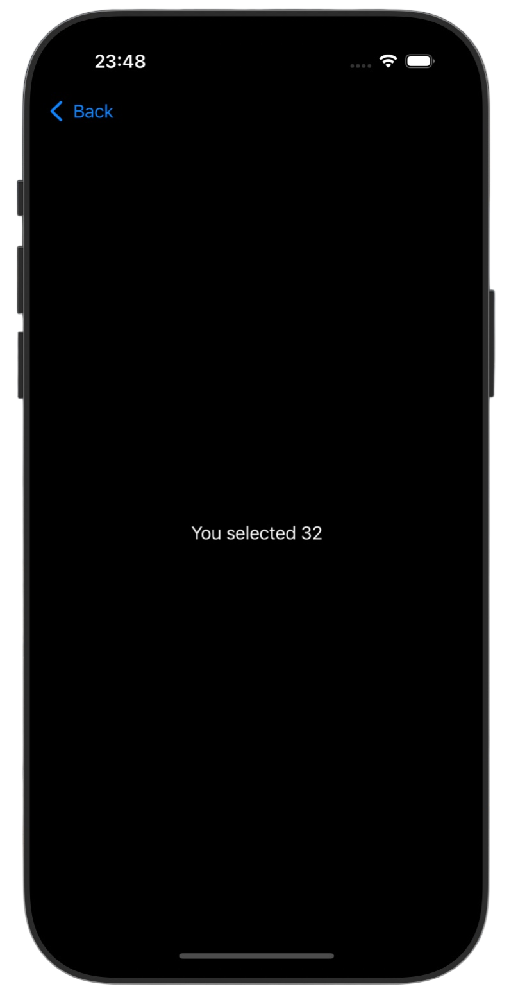
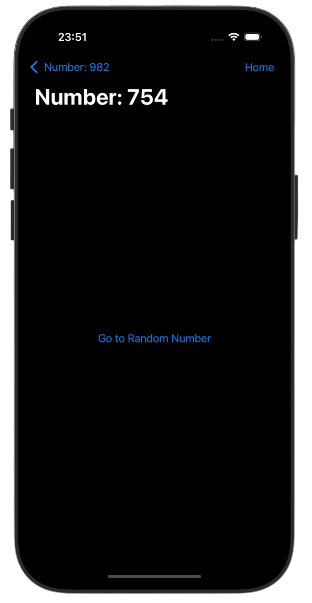
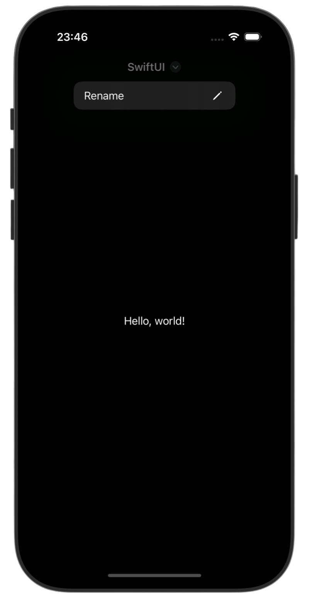

# Navigation 🧭

*[Project 9](https://www.hackingwithswift.com/100/swiftui/43)* from the *[100 Days of SwiftUI course](https://www.hackingwithswift.com/books/ios-swiftui)* by *[Hacking With Swift](https://www.hackingwithswift.com/)*

>SwiftUI navigation fundamentals project focused on building scalable, data-driven navigation flows using NavigationStack, value-based routing, and programmatic navigation

---

## Functionality 🧩
- 📍 Building navigation flows using NavigationStack
- 🛠 Value-based routing using NavigationLink(value:) + navigationDestination(for:)
- 🧠 Programmatic navigation controlled by state
- 📦 Passing strongly-typed data between screens
- 🎨 Navigation bar customization + toolbar integration

---

## Screenshots

<div align="center">
  
  
  
  
</div>

---

## Progress 

<div align="center">
  
**Day 43**

*[Overview](https://www.hackingwithswift.com/100/swiftui/43)*

**Day 44**

*[Implementation](https://www.hackingwithswift.com/100/swiftui/44)*

**Day 45**

*[Implementation 2](https://www.hackingwithswift.com/100/swiftui/45)*

**Day 46**

*[Challenges](https://www.hackingwithswift.com/100/swiftui/46)*

</div>

---

## Challenges

*Instructions taken from [here](https://www.hackingwithswift.com/books/ios-swiftui/navigation-wrap-up)*

| <div align="center">Challenge</div> | <div align="center">Status</div> |
|:---|:---:|
| 1. Change [project 7 (iExpense)](https://github.com/gurman-man/100-days-of-swiftUI/tree/main/Projects/07-iExpense) so that it uses `NavigationLink` for adding new expenses rather than a sheet. (Tip: The `dismiss()` code works great here, but you might want to add the `navigationBarBackButtonHidden()` modifier so they have to explicitly choose Cancel.) | ✅ |
| 2. Try changing [project 7](https://github.com/gurman-man/100-days-of-swiftUI/tree/main/Projects/07-iExpense) so that it lets users edit their issue name in the navigation title rather than a separate textfield. Which option do you prefer? | ✅ |
| 3. Return to [project 8 (Moonshot)](https://github.com/gurman-man/100-days-of-swiftUI/tree/main/Projects/08-Moonshot), and upgrade it to use `NavigationLink(value:)`. This means adding `Hashable` conformance, and thinking carefully how to use `navigationDestination()`. | ✅ |

---

## Installation

1. Clone this repository:  
   ```bash
   git clone https://github.com/gurman-man/100-days-of-swiftUI.git
   ```
2. Open `Projects/09-Navigation/Navigation.xcodeproj` in Xcode
3. Run on the simulator or your device

