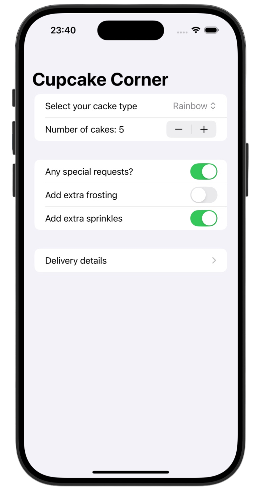
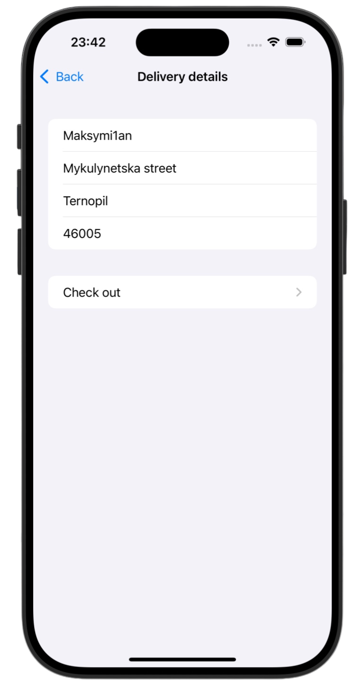
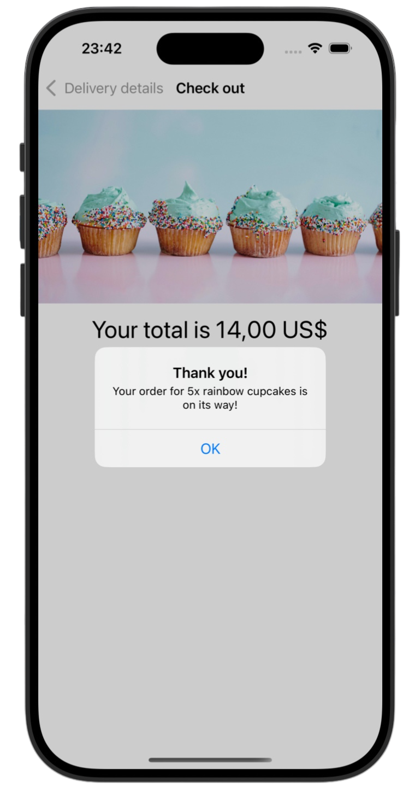

# CupcakeCorner 🥞

*[Project 10](https://www.hackingwithswift.com/100/swiftui/49)* from the *[100 Days of SwiftUI course](https://www.hackingwithswift.com/books/ios-swiftui)* by *[Hacking With Swift](https://www.hackingwithswift.com/)*

>A SwiftUI multi-step ordering app that allows users to customize cupcake orders, enter delivery details, and place orders through a network request with validation and persistent user data

---

## Functionality 🧩
- 🧭 Multi-screen navigation using `NavigationStack`
- 🔗 Shared state with `@Observable` and `@Bindable`
- 📝 Form validation with custom input checks
- 🌐 Networking with `URLSession` (async/await + JSON)
- ⚠️ Error handling with user-friendly alerts

---

## Screenshots

<div align="center">
  
  
  
</div>

---

## Progress 

<div align="center">
  
**Day 49**

*[Overview](https://www.hackingwithswift.com/100/swiftui/49)*

**Day 50**

*[Implementation](https://www.hackingwithswift.com/100/swiftui/50)*

**Day 51**

*[Implementation 2](https://www.hackingwithswift.com/100/swiftui/51)*

**Day 52**

*[Challenges](https://www.hackingwithswift.com/100/swiftui/52)*

</div>

---

## Challenges

*Instructions taken from [here](https://www.hackingwithswift.com/books/ios-swiftui/cupcake-corner-wrap-up)*

| <div align="center">Challenge</div> | <div align="center">Status</div> |
|:---|:---:|
| 1. Our address fields are currently considered valid if they contain anything, even if it’s just only whitespace. Improve the validation to make sure a string of pure whitespace is invalid. | ✅ |
| 2. If our call to `placeOrder()` fails – for example if there is no internet connection – show an informative alert for the user. To test this, try commenting out the `request.httpMethod = "POST"` line in your code, which should force the request to fail. | ✅ |
| 3. For a more challenging task, try updating the `Order` class so it saves data such as the user's delivery address to `UserDefaults`. This takes a little thinking, because `@AppStorage` won't work here, and you'll find getters and setters cause problems with `Codable` support. Can you find a middle ground? | ✅ |

---

## Installation

1. Clone this repository:  
   ```bash
   git clone https://github.com/gurman-man/100-days-of-swiftUI.git
   ```
2. Open `Projects/10-CupcakeCorner/CupcakeCorner.xcodeproj` in Xcode
3. Run on the simulator or your device

