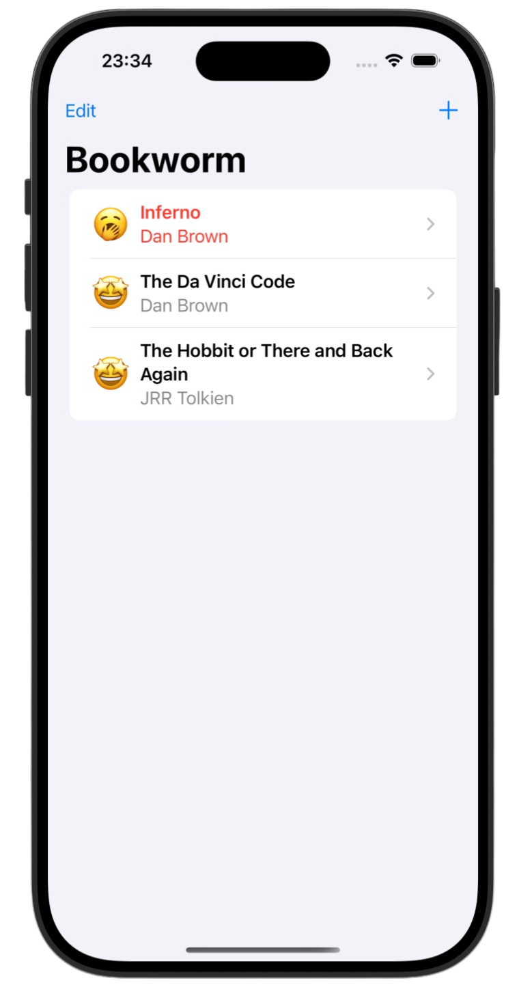
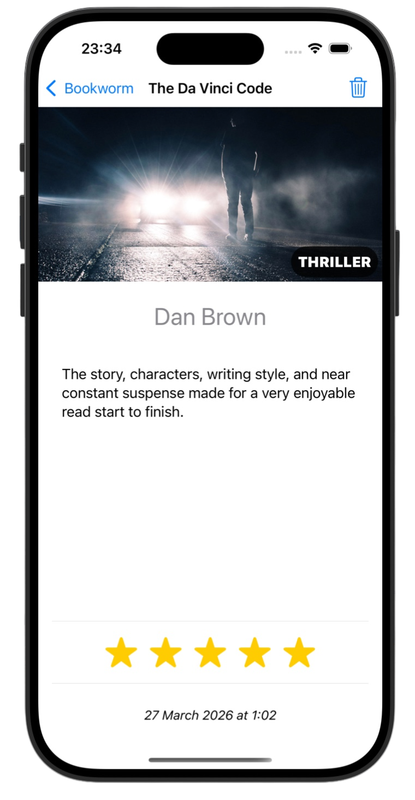
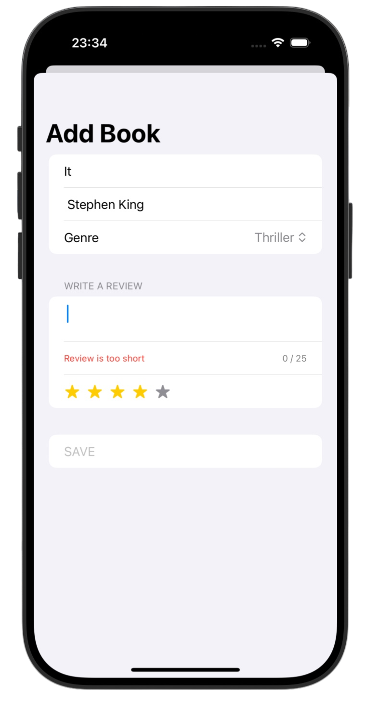

# Bookworm 📚

*[Project 11](https://www.hackingwithswift.com/100/swiftui/53)* from the *[100 Days of SwiftUI course](https://www.hackingwithswift.com/books/ios-swiftui)* by *[Hacking With Swift](https://www.hackingwithswift.com/)*

>A SwiftUI book tracking app that allows users to add, review, rate, and manage books with persistent storage using SwiftData and a clean navigation-based interface

---

## Functionality 🧩
- 📚 Data persistence using SwiftData with `@Model` and `@Query`
- 🧭 Navigation flow with `NavigationStack` and dynamic destinations
- ➕ Add and delete books with modal sheets and swipe actions
- 📅 Date tracking and formatted display for each book
- ⭐ Interactive rating system with custom star and emoji views
- 📝 Review input with validation and user feedback

---

## Screenshots

<div align="center">
  
  
  
</div>

---

## Progress 

<div align="center">
  
**Day 53**

*[Overview](https://www.hackingwithswift.com/100/swiftui/53)*

**Day 54**

*[Implementation](https://www.hackingwithswift.com/100/swiftui/54)*

**Day 55**

*[Implementation 2](https://www.hackingwithswift.com/100/swiftui/55)*

**Day 56**

*[Challenges](https://www.hackingwithswift.com/100/swiftui/56)*

</div>

---

## Challenges

*Instructions taken from [here](https://www.hackingwithswift.com/books/ios-swiftui/bookworm-wrap-up)*

| <div align="center">Challenge</div> | <div align="center">Status</div> |
|:---|:---:|
| 1. Right now it’s possible to select no title, author, or genre for books, which causes a problem for the detail view. Please fix this, either by forcing defaults, validating the form, or showing a default picture for unknown genres – you can choose. | ✅ |
| 2. Modify `ContentView` so that books rated as 1 star are highlighted somehow, such as having their name shown in red. | ✅ |
| 3. Add a new “date” attribute to the Book class, assigning `Date.now` to it so it gets the current date and time, then format that nicely somewhere in `DetailView`. | ✅ |

---

## Installation

1. Clone this repository:  
   ```bash
   git clone https://github.com/gurman-man/100-days-of-swiftUI.git
   ```
2. Open `Projects/11-Bookworm/Bookworm.xcodeproj` in Xcode
3. Run on the simulator or your device

