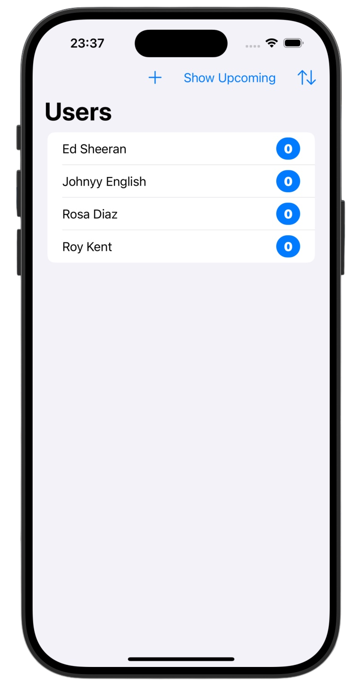
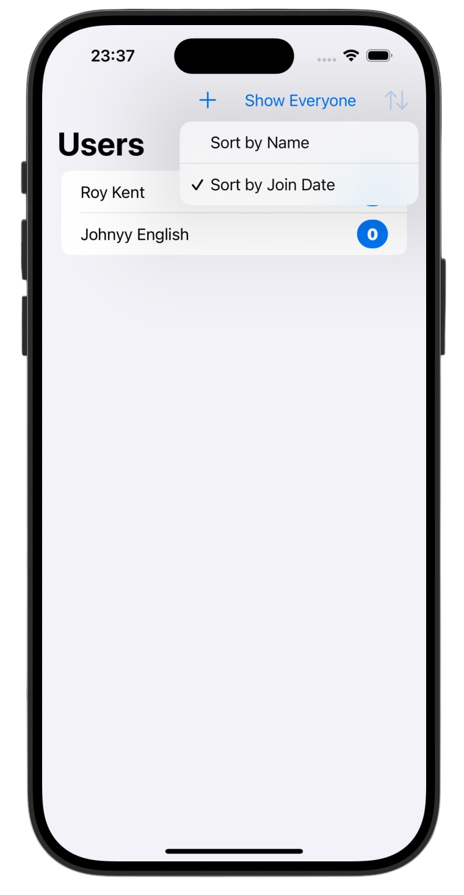
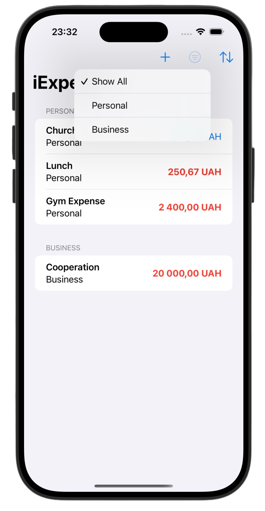

# SwiftData 🔍

*[Project 12](https://www.hackingwithswift.com/100/swiftui/57)* from the *[100 Days of SwiftUI course](https://www.hackingwithswift.com/books/ios-swiftui)* by *[Hacking With Swift](https://www.hackingwithswift.com/)*

>A SwiftUI app demonstrating core SwiftData concepts, including data persistence, relationships, dynamic filtering, and sorting using a reactive data-driven architecture

---

## Functionality 🧩
- 💾 Persistent storage using `SwiftData` (`@Model`, `@Query`, `modelContext`)
- 🔍 Dynamic filtering with `#Predicate`
- ↕️ Flexible sorting using `SortDescriptor` with runtime switching
- 🔗 One-to-many relationships (User ↔ Jobs) with cascade delete rules
- ➕ Data management: insert, delete, and batch reset samples

---

## Screenshots

<div align="center">
  
  
  
</div>

---

## Progress 

<div align="center">
  
**Day 57**

*[Basics](https://www.hackingwithswift.com/100/swiftui/57)*

**Day 58**

*[Advanced Techniques](https://www.hackingwithswift.com/100/swiftui/58)*

**Day 59**

*[Challenges](https://www.hackingwithswift.com/100/swiftui/59)*

</div>

---

## Challenges

*Instructions taken from [here](https://www.hackingwithswift.com/books/ios-swiftui/swiftdata-wrap-up)*  
*All three of these challenges relate to upgrading project 7, [iExpense](https://github.com/gurman-man/100-days-of-swiftUI/Projects/12-SwiftData/07-iExpense-SwiftData)*:

| <div align="center">Challenge</div> | <div align="center">Status</div> |
|:---|:---:|
| 1. Start by upgrading it to use SwiftData. | ✅ |
| 2. Add a customizable sort order option: by name or by amount. | ✅ |
| 3. Add a filter option to show all expenses, just personal expenses, or just business expenses. | ✅ |

---

## Installation

1. Clone this repository:  
   ```bash
   git clone https://github.com/gurman-man/100-days-of-swiftUI.git
   ```
2. Open `Projects/12-SwiftData/12-SwiftDataProject.xcodeproj` in Xcode
3. Run on the simulator or your device

