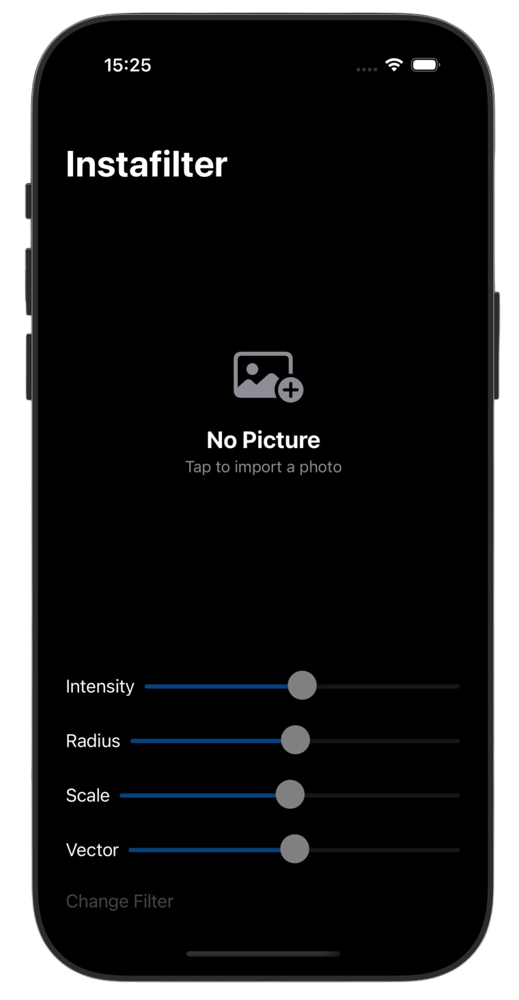
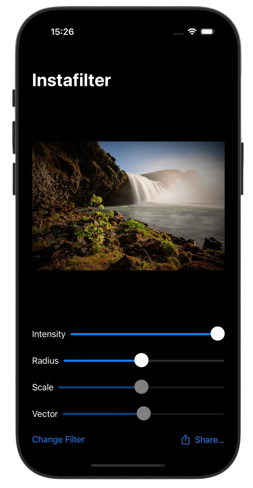
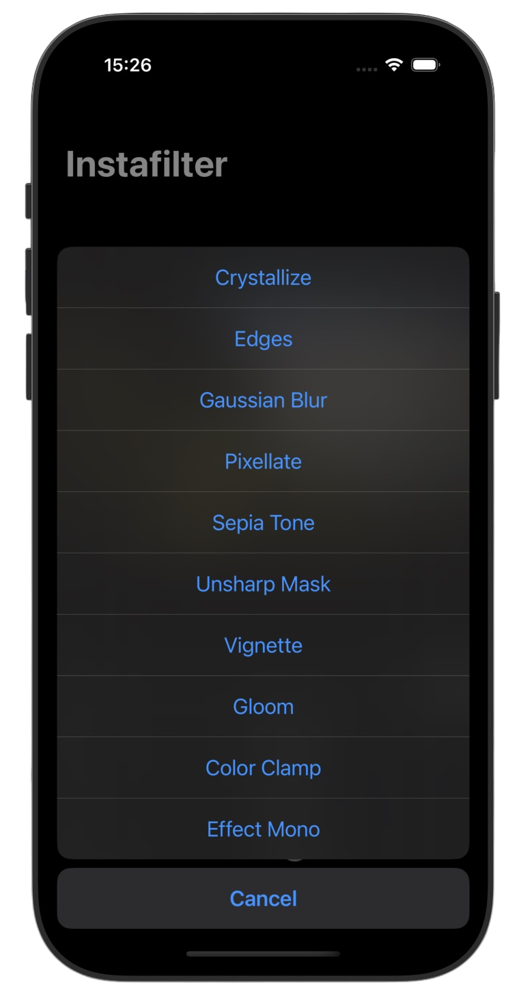
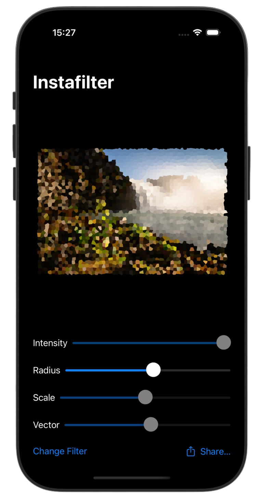

# Instafilter 🌈

*[Project 13](https://www.hackingwithswift.com/100/swiftui/62)* from the *[100 Days of SwiftUI course](https://www.hackingwithswift.com/books/ios-swiftui)* by *[Hacking With Swift](https://www.hackingwithswift.com/)*

>A SwiftUI photo editing app that lets users import images, apply real-time Core Image filters, customize filter parameters, and share processed photos 

---

## Functionality 🧩
- 🖼️ Photo importing using `PhotosPicker`
- 🧭 Real-time image processing with Core Image filters
- 🎛️ Dynamic filter controls with multiple adjustable sliders
- 📤 Image sharing with `ShareLink` integration
- ⭐ Smart App Store review request flow using `requestReview()` and `@AppStorage`
- 🧩 Support for multiple custom filters including Sepia, Pixelate, Crystallize, Gloom, and Vignette

---

## Screenshots

<div align="center">
  
  
  
  
</div>

---

## Progress 

<div align="center">
  
**Day 62**

*[Overview](https://www.hackingwithswift.com/100/swiftui/62)*

**Day 63**

*[Overview 2](https://www.hackingwithswift.com/100/swiftui/63)*

**Day 64**

*[Overview 3](https://www.hackingwithswift.com/100/swiftui/64)*

**Day 65**

*[Implementation](https://www.hackingwithswift.com/100/swiftui/65)*

**Day 66**

*[Implementation 2](https://www.hackingwithswift.com/100/swiftui/66)*

**Day 67**

*[Challenges](https://www.hackingwithswift.com/100/swiftui/67)*

</div>

---

## Challenges

*Instructions taken from [here](https://www.hackingwithswift.com/books/ios-swiftui/instafilter-wrap-up)*

| <div align="center">Challenge</div> | <div align="center">Status</div> |
|:---|:---:|
| 1. Try making the Slider and Change Filter buttons disabled if there is no image selected. | ✅ |
| 2. Experiment with having more than one slider, to control each of the input keys you care about. For example, you might have one for radius and one for intensity. | ✅ |
| 3. Explore the range of available Core Image filters, and add any three of your choosing to the app. | ✅ |

---

## Installation

1. Clone this repository:  
   ```bash
   git clone https://github.com/gurman-man/100-days-of-swiftUI.git
   ```
2. Open `Projects/13-Instafilter/Instafilter.xcodeproj` in Xcode
3. Run on the simulator or your device

